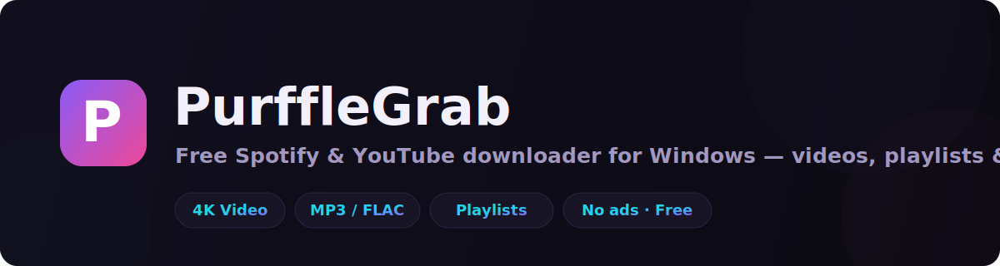
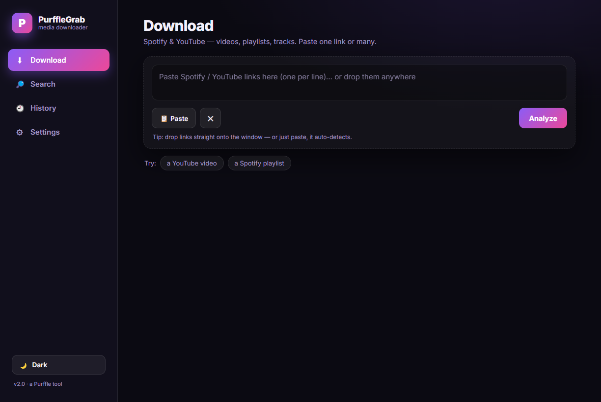
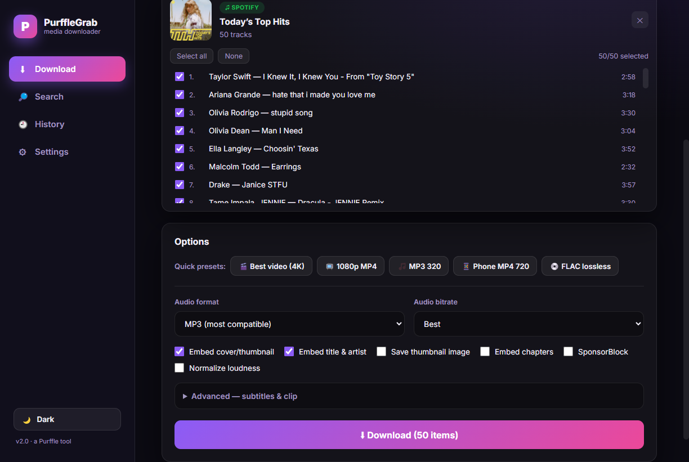
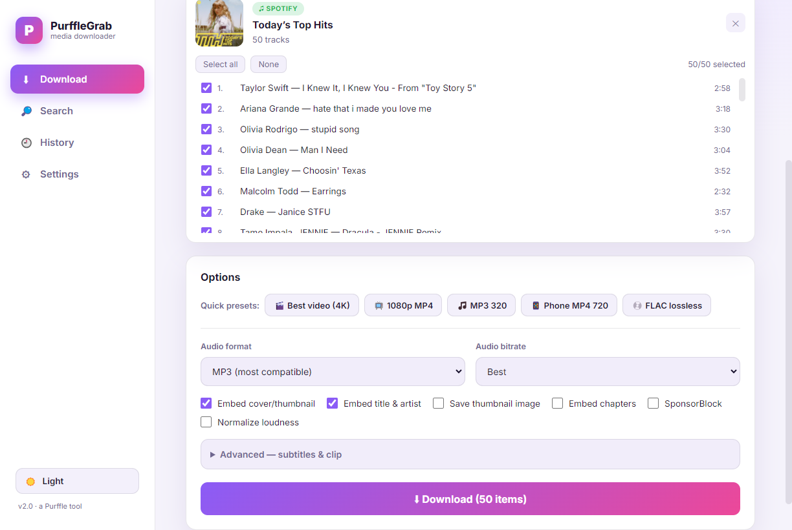
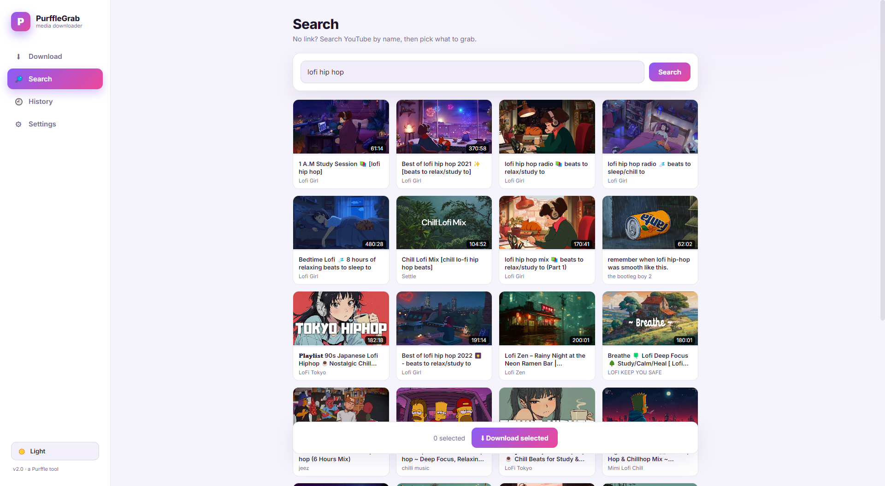

<div align="center">



# PurffleGrab — Free Spotify &amp; YouTube Downloader for Windows

**Download Spotify playlists, YouTube videos, and music to MP3, MP4, or 4K — free, ad-free, and in one click.**

[](https://github.com/Chamanrajragu/purffle-grab/releases/latest)
[](https://github.com/Chamanrajragu/purffle-grab/releases)
[](https://github.com/Chamanrajragu/purffle-grab/releases)
[](LICENSE)
[](https://github.com/Chamanrajragu/purffle-grab/releases)
[](https://purffle.com/purffle-grab/)

### 🌐 [**Visit the website →**](https://purffle.com/purffle-grab/)

</div>

---

**PurffleGrab** is a free, open-source **Spotify and YouTube downloader** for Windows. Paste a link —
or many — pick your format, and grab it. No accounts, no ads, no subscriptions, and nothing extra to
install: **FFmpeg** and the **yt-dlp** engine are bundled right inside the app.

> 🎸 Built so you can put your own music and videos on your phone, MP3 player, or any device — offline.

## ⬇️ Download &amp; install

1. Grab the latest **[`PurffleGrab-Setup.exe`](https://github.com/Chamanrajragu/purffle-grab/releases/latest)**.
2. Run it — installs per-user (no admin) and adds **Desktop + Start-menu** shortcuts.
3. Open **PurffleGrab** and start downloading. That's it.

> First launch may show a Windows SmartScreen notice (the app isn't code-signed yet) — click
> **More info → Run anyway**.

## ✨ Features

| | |
|---|---|
| 🎬 **YouTube videos &amp; playlists** | Download in up to **4K**, or **audio-only**. |
| 🎵 **Spotify tracks &amp; playlists** | Reads the track list, finds the best audio, tags it with **cover art + artist**. |
| 📋 **Batch &amp; drag-and-drop** | Paste many links at once, drop them on the window, or paste from clipboard. |
| ✅ **Track picker** | Choose exactly which songs from a playlist to grab. |
| ⚡ **Quick presets** | Best video (4K), 1080p MP4, MP3 320, Phone MP4 720, FLAC lossless. |
| 🔊 **Formats** | Video: MP4 (H.264/AAC). Audio: MP3, M4A, FLAC, WAV, Opus @ 320/256/192/128 kbps. |
| 🎚️ **Extras** | SponsorBlock, subtitles, clip/trim, embed chapters, normalize loudness. |
| 🔎 **Search** | Find videos by keyword — no link needed. |
| 🕘 **History** | Re-open, re-zip, or re-grab past downloads. |
| ⚙️ **Settings** | Custom folder, default options, dark/light theme, simultaneous downloads, notifications. |
| 🖥️ **100% local &amp; private** | Everything runs on your PC. Nothing is uploaded anywhere. |

## 📸 Screenshots

<div align="center">




</div>

## 🚀 How to use

1. **Paste a link** — a Spotify or YouTube URL (one or many, one per line).
2. **Click Analyze** — PurffleGrab reads the video/track list.
3. **Pick options** — video or audio, quality, format; tick which playlist tracks you want.
4. **Click Download** — watch live progress, then **Open file** or **Show in folder**.

Files are saved to `Music\PurffleGrab\` by default (change it in **Settings**).

## 🛠️ Build from source

Requirements: **Node.js 18+** on Windows.

```bash
git clone https://github.com/Chamanrajragu/purffle-grab.git
cd PurffleGrab
npm install
powershell -ExecutionPolicy Bypass -File scripts/setup.ps1   # fetch yt-dlp + ffmpeg into bin/

npm start        # run the desktop app
npm run server   # OR just the web server at http://localhost:7777
npm run dist     # build release/win-unpacked
```

To produce the installer, compile `installer.nsi` with NSIS:
```bash
makensis installer.nsi   # → release/PurffleGrab-Setup-x.x.x.exe
```

## 🧩 How it works

- **YouTube** is handled directly by [yt-dlp](https://github.com/yt-dlp/yt-dlp); video is muxed to
  device-friendly **H.264/AAC MP4** with [FFmpeg](https://ffmpeg.org/).
- **Spotify** is DRM-protected, so PurffleGrab reads the public track list (title, artist, cover —
  no API key), finds the closest match on YouTube, downloads the audio, and writes clean ID3 tags +
  album art. This is the same approach used by popular tools like `spotDL`.

## ❓ FAQ

<details><summary><b>Is PurffleGrab free?</b></summary>
Yes — completely free and open-source. No ads, no accounts, no limits.</details>

<details><summary><b>How do I download a Spotify playlist to MP3?</b></summary>
Paste the playlist link, click Analyze, choose <b>Audio → MP3</b>, tick the tracks you want, and click Download.</details>

<details><summary><b>Can it download YouTube videos in 4K?</b></summary>
Yes — choose the <b>Best video (4K)</b> preset or set quality to 2160p.</details>

<details><summary><b>Do I need to install FFmpeg or Python?</b></summary>
No. FFmpeg and the yt-dlp engine are bundled inside the installer.</details>

<details><summary><b>Where are my downloads saved?</b></summary>
In <code>Music\PurffleGrab\</code> by default. You can change the folder in Settings.</details>

<details><summary><b>Does it work on Mac or Linux?</b></summary>
The installer is Windows-only, but you can run the web server (<code>npm run server</code>) on any OS with Node.js.</details>

## ⚠️ Disclaimer

PurffleGrab is provided for **personal use** — for example, putting your own purchased or
license-free media onto your devices. Downloading copyrighted content may violate the Terms of
Service of Spotify/YouTube and copyright law in your country. **You are responsible for how you use
this tool.** The authors do not endorse piracy and accept no liability for misuse.

## 🙌 Credits

Built with [Electron](https://www.electronjs.org/), [yt-dlp](https://github.com/yt-dlp/yt-dlp), and
[FFmpeg](https://ffmpeg.org/). A **[Purffle](https://purffle.com)** tool.

## 📄 License

[MIT](LICENSE) © Purffle (Pykara Technologies). Bundled tools retain their own licenses.

---

<div align="center">
<sub>Keywords: free spotify downloader · youtube to mp3 · youtube downloader 4k · spotify playlist downloader ·
download youtube playlist · youtube to mp4 · music downloader for windows · spotify to mp3 converter</sub>
</div>
