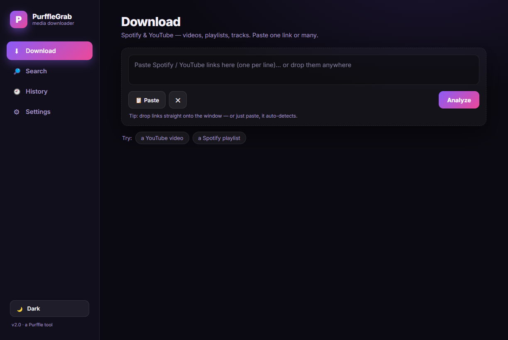
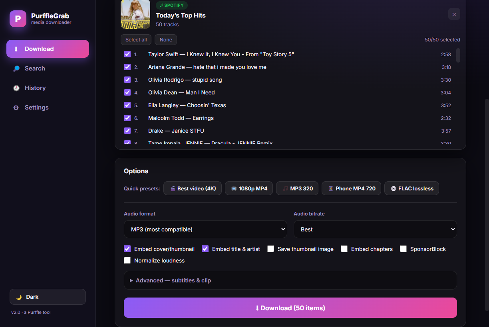
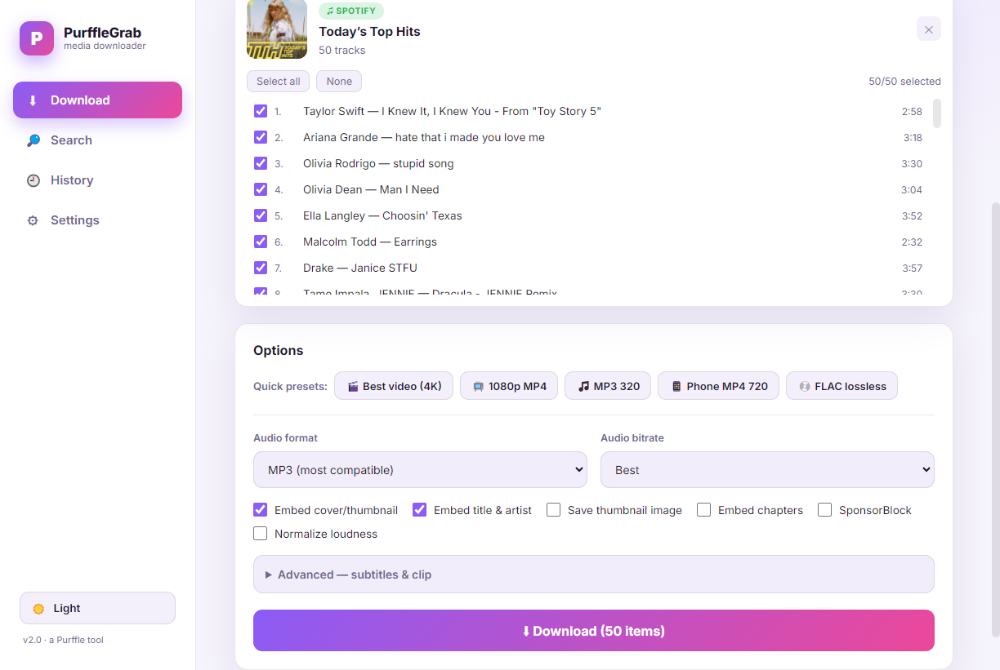
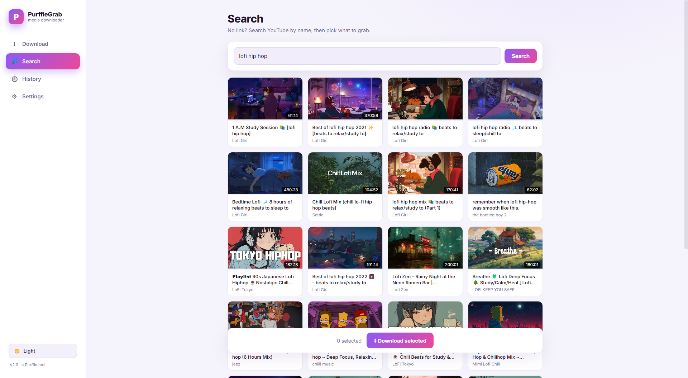

<div align="center">


# PurffleGrab — Free Spotify &amp; YouTube Downloader for Windows

**Download Spotify playlists, YouTube videos, and music to MP3, MP4, FLAC, or 4K — free, ad-free, open-source.**

[](https://github.com/Chamanrajragu/purffle-grab/releases/latest)
[](https://github.com/Chamanrajragu/purffle-grab/releases)
[](https://github.com/Chamanrajragu/purffle-grab/releases)
[](LICENSE)
[](https://github.com/Chamanrajragu/purffle-grab/actions)
[](https://github.com/Chamanrajragu/purffle-grab/releases)
[](https://chamanrajragu.github.io/purffle-grab/)

### ⭐ Star this repo if you find it useful! &nbsp;·&nbsp; 🌐 [**Visit the website →**](https://chamanrajragu.github.io/purffle-grab/)

</div>

---

**PurffleGrab** is a free, open-source **Spotify and YouTube downloader** for Windows. Paste a link —
or many — pick your format, and grab it. No accounts, no ads, no subscriptions, and nothing extra to
install: **FFmpeg** and the **yt-dlp** engine are bundled right inside the app.

> 🎸 Built so you can put your own music and videos on your phone, MP3 player, or any device — offline.

## ⬇️ Download &amp; Install

1. Grab the latest **[`PurffleGrab-Setup.exe`](https://github.com/Chamanrajragu/purffle-grab/releases/latest)**.
2. Run it — installs per-user (no admin) and adds **Desktop + Start-menu** shortcuts.
3. Open **PurffleGrab** and start downloading. That's it.

> First launch may show a Windows SmartScreen notice (the app isn't code-signed yet) — click
> **More info → Run anyway**.

## ✨ Features

### Core Downloads
| | |
|---|---|
| 🎬 **YouTube videos &amp; playlists** | Download in up to **4K**, or **audio-only**. |
| 🎵 **Spotify tracks &amp; playlists** | Reads the track list, finds the best audio, tags it with **cover art + artist**. |
| 📋 **Batch &amp; drag-and-drop** | Paste many links at once, drop them on the window, or import from a `.txt` file. |
| ✅ **Track picker &amp; filter** | Choose exactly which songs from a playlist to grab, with in-list search/filter. |
| ⚡ **Quick presets** | 4K video, 1080p MP4, MP3 320, Phone MP4 720, FLAC lossless, Podcast, Ringtone, Audiobook. |
| 🔊 **Formats** | Audio: MP3, M4A, FLAC, WAV, Opus, OGG, AAC. Video: MP4 (H.264/AAC). |

### New in v3.0
| | |
|---|---|
| ⏰ **Download scheduler** | Schedule downloads for later — one-time, daily, or weekly. |
| 🎨 **Premium glassmorphism UI** | Completely redesigned with backdrop blur, glass cards, smooth animations. |
| 🖼 **Custom app icon** | Unique PurffleGrab icon (no more default Electron icon). |
| 📖 **Audiobook preset** | MP3 64 kbps preset for audiobooks &amp; spoken content. |
| ✂ **Split by chapters** | Split downloaded videos into separate files by chapter markers. |
| ⏱ **Speed limiter** | Limit download speed to avoid saturating your connection. |
| 🎨 **9 accent colors** | Purple, blue, green, amber, red, pink, cyan, orange, lime. |
| 📊 **Animated stats** | Stat values animate on load; day streak counter; estimated total size. |
| ⌨ **More shortcuts** | Ctrl+S settings, Ctrl+1-9 views, click-outside to close modals. |
| 🖨 **Print styles** | Clean print layout with sidebar hidden. |
| ♿ **Better accessibility** | Skip link, ARIA labels, focus-visible, reduced motion support. |
| 🔍 **100/100 SEO landing page** | Schema.org (5 types), HowTo, WebSite, 12 FAQ, skip link, aria labels. |

### From v2.1
| | |
|---|---|
| 📋 **Queue system** | Add items to a download queue, manage, and batch-start. |
| 🔄 **Format converter** | Convert between audio/video formats right inside the app. |
| 📊 **Statistics dashboard** | Total downloads, format breakdown, activity chart, source stats. |
| ⌨ **Keyboard shortcuts** | Ctrl+V paste, Ctrl+Enter download, Ctrl+1-9 navigate, Ctrl+D theme, ? help. |
| 📄 **File import** | Import URLs from `.txt` files or drag &amp; drop text files. |
| 🔎 **Search improvements** | Sort results, select all/clear, filter chips, add to queue from search. |
| 📤 **Export/import** | Export/import settings and history as JSON. |
| 🎯 **Filename templates** | Custom filename patterns with `%(title)s`, `%(uploader)s`, etc. |
| 🏠 **Onboarding tour** | First-time users get a guided tour of the app. |

### Advanced Options
| | |
|---|---|
| 🎚️ **SponsorBlock** | Skip sponsors, intros, outros in YouTube videos. |
| 💬 **Subtitles** | Download &amp; embed subtitles in any language, including auto-generated. |
| ✂ **Clip / trim** | Download just a section of a video with start/end times. |
| 📖 **Chapters** | Embed or split by chapter markers. |
| 🔈 **Normalize** | Normalize audio loudness across tracks. |
| 🖼 **Thumbnails** | Embed or save cover art / thumbnails. |

### App
| | |
|---|---|
| 🌙 **Dark &amp; light themes** | Glassmorphism themes with smooth transitions. |
| 🕘 **History** | Search, filter, paginate, export, re-grab past downloads. |
| ⚙ **Settings** | Custom folder, defaults, notifications, concurrent downloads, engine updates. |
| 🔒 **Privacy** | No telemetry, no analytics, no trackers. 100% local. |

## 📸 Screenshots

<div align="center">




</div>

## 🚀 How to Use

1. **Paste a link** — a Spotify or YouTube URL (one or many, one per line, or import from file).
2. **Click Analyze** — PurffleGrab reads the video/track list.
3. **Pick options** — video or audio, quality, format; use presets or customize.
4. **Click Download** — watch live progress, then **Open file**, **Convert**, or **Share**.

Files are saved to `Music\PurffleGrab\` by default (change it in **Settings**).

### Keyboard Shortcuts

| Shortcut | Action |
|---|---|
| `Ctrl+V` | Paste &amp; auto-detect links |
| `Ctrl+Enter` | Analyze / Download |
| `Ctrl+F` | Focus search |
| `Ctrl+1-9` | Switch views |
| `Ctrl+D` | Toggle dark/light theme |
| `Ctrl+Q` | Open queue |
| `Ctrl+S` | Open settings |
| `Escape` | Close modal / Cancel |
| `?` | Show shortcuts help |

## 🛠️ Build from Source

Requirements: **Node.js 18+** on Windows.

```bash
git clone https://github.com/Chamanrajragu/purffle-grab.git
cd PurffleGrab
npm install
powershell -ExecutionPolicy Bypass -File scripts/setup.ps1   # fetch yt-dlp + ffmpeg into bin/

npm start        # run the desktop app
npm run server   # OR just the web server at http://localhost:7777
npm run dist     # build release/win-unpacked
```

To produce the installer, compile `installer.nsi` with NSIS:
```bash
makensis installer.nsi   # → release/PurffleGrab-Setup-x.x.x.exe
```

## 🧩 How it Works

- **YouTube** is handled directly by [yt-dlp](https://github.com/yt-dlp/yt-dlp); video is muxed to
  device-friendly **H.264/AAC MP4** with [FFmpeg](https://ffmpeg.org/).
- **Spotify** is DRM-protected, so PurffleGrab reads the public track list (title, artist, cover —
  no API key), finds the closest match on YouTube, downloads the audio, and writes clean ID3 tags +
  album art. This is the same approach used by popular tools like `spotDL`.

## ❓ FAQ

<details><summary><b>Is PurffleGrab free?</b></summary>
Yes — completely free and open-source under MIT. No ads, no accounts, no limits.</details>

<details><summary><b>How do I download a Spotify playlist to MP3?</b></summary>
Paste the playlist link, click Analyze, choose <b>Audio → MP3</b>, tick the tracks you want, and click Download.</details>

<details><summary><b>Can it download YouTube videos in 4K?</b></summary>
Yes — choose the <b>Best video (4K)</b> preset or set quality to 2160p.</details>

<details><summary><b>Do I need to install FFmpeg or Python?</b></summary>
No. FFmpeg and the yt-dlp engine are bundled inside the installer.</details>

<details><summary><b>Where are my downloads saved?</b></summary>
In <code>Music\PurffleGrab\</code> by default. You can change the folder in Settings.</details>

<details><summary><b>Does it work on Mac or Linux?</b></summary>
The installer is Windows-only, but you can run the web server (<code>npm run server</code>) on any OS with Node.js.</details>

<details><summary><b>Can I convert files after downloading?</b></summary>
Yes! Go to the Convert tab and drop any audio/video file to convert between formats.</details>

<details><summary><b>What's the queue system?</b></summary>
Add items to a queue from the download or search views, then start them all at once. Great for batch downloading.</details>

<details><summary><b>What's the download scheduler?</b></summary>
Schedule downloads for a specific date and time. Set one-time, daily, or weekly schedules. PurffleGrab will start the download automatically.</details>

<details><summary><b>Can I split a video by chapters?</b></summary>
Yes! Enable "Split by chapters" in the advanced options. Each chapter becomes a separate file.</details>

## ⚠️ Disclaimer

PurffleGrab is provided for **personal use** — for example, putting your own purchased or
license-free media onto your devices. Downloading copyrighted content may violate the Terms of
Service of Spotify/YouTube and copyright law in your country. **You are responsible for how you use
this tool.** The authors do not endorse piracy and accept no liability for misuse.

## 🙌 Credits

Built with [Electron](https://www.electronjs.org/), [yt-dlp](https://github.com/yt-dlp/yt-dlp), and
[FFmpeg](https://ffmpeg.org/). A **[Purffle](https://purffle.com)** tool.

## 📄 License

[MIT](LICENSE) © Purffle. Bundled tools retain their own licenses.

---

<div align="center">
<sub>Keywords: free spotify downloader · youtube to mp3 · youtube downloader 4k · spotify playlist downloader ·
download youtube playlist · youtube to mp4 · music downloader for windows · spotify to mp3 converter ·
flac downloader · youtube to flac · batch downloader · open source downloader · best youtube downloader 2026 ·
free spotify downloader 2026 · download scheduler · format converter · sponsorblock downloader</sub>
</div>

---

<!-- purffle-ecosystem -->
## 🧩 The Purffle Toolset

**PurffleGrab** is part of **[Purffle](https://purffle.com)** — a growing set of free, open-source tools built in the open. **If this saved you time, please drop a ⭐ — it genuinely helps the project reach more people!**

| Tool | What it does |
|------|--------------|
| 🎵 **[PurffleGrab](https://github.com/Chamanrajragu/purffle-grab)** 👈 | Free Spotify & YouTube downloader — MP3, MP4, FLAC, 4K |
| 🎥 **[PurffleVision](https://github.com/Chamanrajragu/purffle-vision)** | AI video creation — any topic to a finished video |
| ⚡ **[PurffleShorts](https://github.com/Chamanrajragu/purffle-shorts)** | Autonomous YouTube Shorts generator |
| 📈 **[PurffleTrader](https://github.com/Chamanrajragu/purffle-trader)** | Crypto paper-trading bot — Binance, EMA + RSI |
| 🤖 **[PurffleCopyBot](https://github.com/Chamanrajragu/purffle-copybot)** | Copy-trading bot — mirror top Hyperliquid traders |

<sub>🌐 [purffle.com](https://purffle.com) · 💼 by [Chaman Raj](https://github.com/Chamanrajragu) · ⭐ Star to support open-source</sub>
