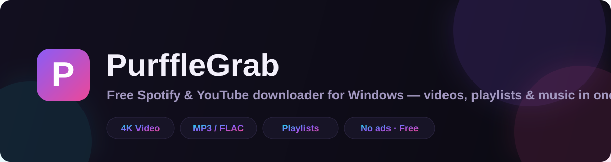
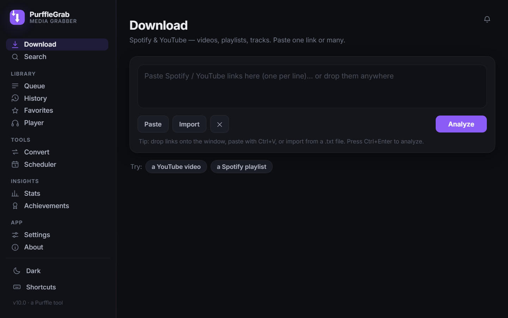
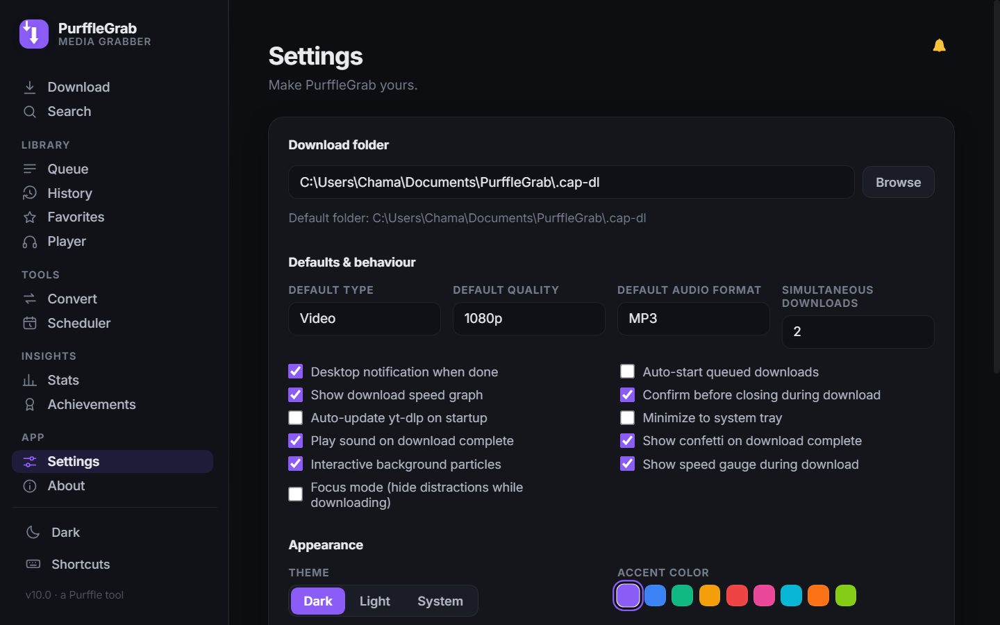
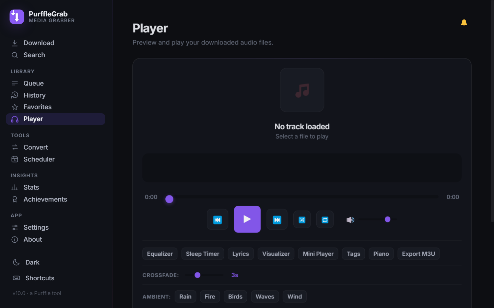
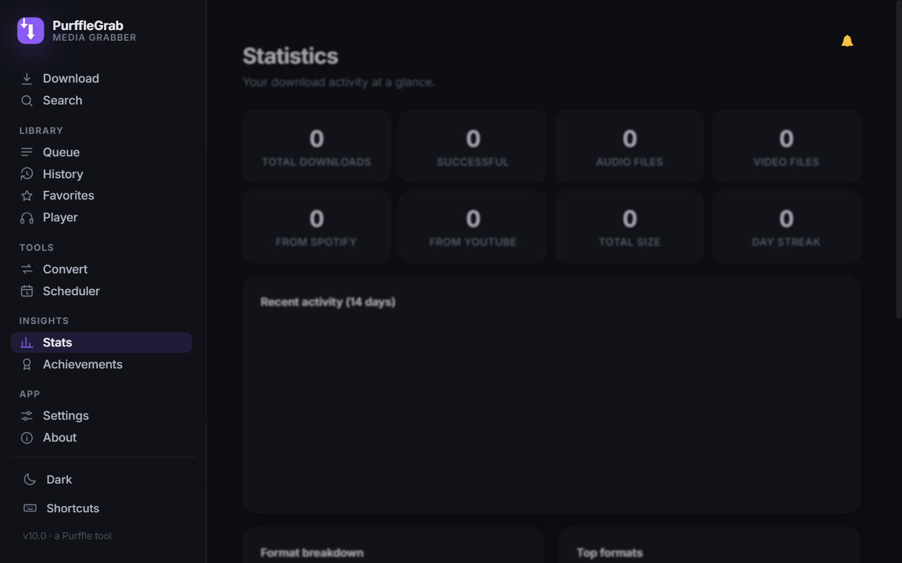
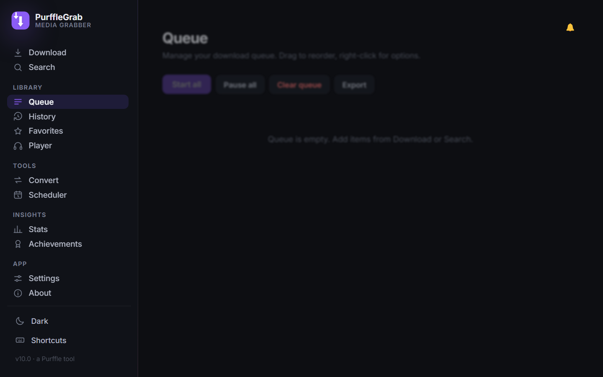
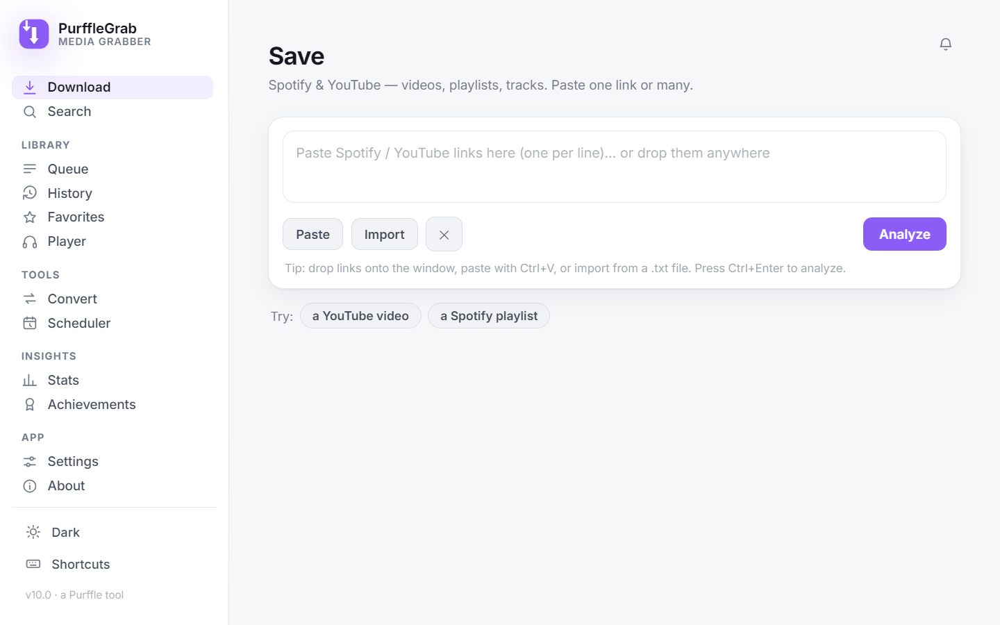

# PurffleGrab — Free Spotify &amp; YouTube Downloader for Windows, Mac &amp; Linux

**Download Spotify albums, playlists and YouTube videos to MP3, FLAC or 4K MP4. No ads, no account, no limits — and nothing leaves your machine.**

### 🌐 [**Visit the website →**](https://purffle.com/purffle-grab/)

---

**PurffleGrab** is a free **Spotify and YouTube downloader** for **Windows, macOS and Linux**.
Paste a link — or fifty — pick your format, and grab it. No accounts, no ads, no subscriptions,
and nothing extra to install: **FFmpeg** and the **yt-dlp** engine are bundled right inside.

> 🎸 Built so you can put your own music and videos on your phone, MP3 player, or any device — offline.

## ⬇️ Download

| Platform | Download |
|----------|----------|
| 🖥 **Windows** | [PurffleGrab-Setup.exe](https://github.com/Chamanrajragu/purffle-grab/releases/latest) (Windows 10/11 x64) |
| 🍎 **macOS** | [PurffleGrab.dmg](https://github.com/Chamanrajragu/purffle-grab/releases/latest) (macOS 10.15+, Intel &amp; Apple Silicon) |
| 🐧 **Linux** | [PurffleGrab.AppImage](https://github.com/Chamanrajragu/purffle-grab/releases/latest) or [.deb](https://github.com/Chamanrajragu/purffle-grab/releases/latest) (Ubuntu 18.04+) |

> First launch on Windows may show a SmartScreen notice — click **More info → Run anyway**.

## ✨ Features

### Core downloads
| | |
|---|---|
| 🎬 **YouTube videos &amp; playlists** | Download in up to **4K**, or **audio-only**. |
| 🎵 **Spotify tracks, albums &amp; playlists** | Reads the track list, finds the best audio, tags it with **cover art + artist**. |
| 📋 **Batch &amp; drag-and-drop** | Paste many links at once, drop them on the window, or import from a `.txt` file. |
| ✅ **Track picker &amp; filter** | Choose exactly which songs from a playlist to grab, with in-list search. |
| ⚡ **Quick presets** | 4K video, 1080p MP4, MP3 320, Phone MP4 720, FLAC lossless, Podcast, Ringtone, Audiobook. |
| 🔊 **Formats** | Audio: MP3, M4A, FLAC, WAV, Opus, OGG, AAC. Video: MP4 (H.264/AAC). |

### Advanced
| | |
|---|---|
| 🎚️ **SponsorBlock** | Skip sponsors, intros and outros in YouTube videos. |
| 💬 **Subtitles** | Download &amp; embed subtitles in any language, including auto-generated. |
| ✂ **Clip / trim** | Download just a section of a video with start/end times. |
| 📖 **Chapters** | Embed or split by chapter markers. |
| 🎯 **Filename templates** | Custom patterns with `%(title)s`, `%(uploader)s`, and more. |
| ⏱ **Speed limiter** | Cap the transfer rate so a big grab doesn't saturate your connection. |

### The app
| | |
|---|---|
| 📋 **Queue &amp; scheduler** | Batch downloads, and schedule them once, daily or weekly. |
| 🔄 **Built-in converter** | Convert between audio and video formats without leaving the app. |
| 🎧 **Audio player** | 5-band equaliser, three visualiser modes, crossfade, sleep timer. |
| 🔎 **YouTube search** | No link? Search by name and send results straight to the queue. |
| 📊 **Statistics** | Totals, format breakdown, activity chart and streaks. |
| 🎨 **Themes** | Dark, light and system, nine accent colours, six mood themes. |
| ⌨ **Keyboard shortcuts** | Command palette (Ctrl+K), quick navigation, and more. |
| 🔒 **Privacy** | No telemetry, no analytics, no trackers. Everything runs locally. |

## 📸 Screenshots

## 🚀 How to use

1. **Paste a link** — a Spotify or YouTube URL (one or many, one per line, or import from a file).
2. **Click Analyze** — PurffleGrab reads the video or track list.
3. **Pick options** — video or audio, quality, format; use a preset or customise.
4. **Click Download** — watch live progress, then **Open file**, **Convert**, or **Share**.

Files are saved to `Music\PurffleGrab\` by default (change it in **Settings**).

## 🧩 How it works

- **YouTube** is handled by [yt-dlp](https://github.com/yt-dlp/yt-dlp); video is muxed to
  device-friendly **H.264/AAC MP4** with [FFmpeg](https://ffmpeg.org/).
- **Spotify** is DRM-protected, so PurffleGrab reads the public track list (title, artist,
  cover — no API key), finds the closest match, downloads the audio, and writes clean ID3
  tags and album art. It does not break Spotify's DRM.

## ❓ FAQ

<b>Is PurffleGrab free?</b>

Yes — free to download and use for personal purposes. No ads, no accounts, no limits.

<b>How do I download a Spotify playlist to MP3?</b>

Paste the playlist link, click Analyze, choose <b>Audio → MP3</b>, tick the tracks you want, and click Download.

<b>Can it download YouTube videos in 4K?</b>

Yes — choose the <b>Best video (4K)</b> preset or set quality to 2160p.

<b>Do I need to install FFmpeg or Python?</b>

No. FFmpeg and the yt-dlp engine are bundled inside the installer.

<b>Where are my downloads saved?</b>

In <code>Music\PurffleGrab\</code> by default. You can change the folder in Settings.

<b>Does it work on Mac or Linux?</b>

Yes — Windows, macOS (Intel &amp; Apple Silicon) and Linux (AppImage &amp; DEB).

<b>Does it collect any data?</b>

No. There is no telemetry, no analytics and no trackers. It talks only to the services whose links you paste.

## 🐛 Found a bug?

[Open an issue](https://github.com/Chamanrajragu/purffle-grab/issues) — please include your
operating system, the app version, and what you were doing when it happened.

## ⚠️ Disclaimer

PurffleGrab is provided for **personal use** — for example, putting your own purchased or
license-free media onto your devices. Downloading copyrighted content may violate the Terms
of Service of Spotify/YouTube and copyright law in your country. **You are responsible for
how you use this tool.** The authors do not endorse piracy and accept no liability for misuse.

## 📄 Licence

PurffleGrab v10.0.0 and later are distributed under the [End User Licence Agreement](LICENSE).
Versions up to 9.0.0 were released under the MIT Licence, which remains in force for those
versions.

Bundled components keep their own licences — including **FFmpeg (GPL v3)** and **yt-dlp
(Unlicense)**. See [THIRD-PARTY-NOTICES.md](THIRD-PARTY-NOTICES.md), which includes a written
offer for the FFmpeg source.

Built with [Electron](https://www.electronjs.org/), [yt-dlp](https://github.com/yt-dlp/yt-dlp)
and [FFmpeg](https://ffmpeg.org/). A **[Purffle](https://purffle.com)** tool.

---

Keywords: free spotify downloader · youtube to mp3 · youtube downloader 4k · spotify playlist downloader ·
download youtube playlist · youtube to mp4 · music downloader · spotify to mp3 converter ·
flac downloader · youtube to flac · batch downloader · best youtube downloader 2026 ·
free spotify downloader 2026 · youtube downloader mac · spotify downloader linux · youtube downloader windows ·
audio player equalizer · music visualizer · youtube to mp3 mac · free music downloader · youtube downloader no ads

---

<!-- purffle-ecosystem -->
## 🧩 The Purffle Toolset

**PurffleGrab** is part of **[Purffle](https://purffle.com)** — a growing set of free tools.

| Tool | What it does |
|------|--------------|
| 🎵 **[PurffleGrab](https://github.com/Chamanrajragu/purffle-grab)** 👈 | Free Spotify &amp; YouTube downloader — MP3, MP4, FLAC, 4K |
| 🎥 **[PurffleVision](https://github.com/Chamanrajragu/purffle-vision)** | AI video creation — any topic to a finished video |
| ⚡ **[PurffleShorts](https://github.com/Chamanrajragu/purffle-shorts)** | Autonomous YouTube Shorts generator |
| 📈 **[PurffleTrader](https://github.com/Chamanrajragu/purffle-trader)** | Crypto paper-trading bot — Binance, EMA + RSI |
| 🤖 **[PurffleCopyBot](https://github.com/Chamanrajragu/purffle-copybot)** | Copy-trading bot — mirror top Hyperliquid traders |

🌐 [purffle.com](https://purffle.com) · 💼 by [Chaman Raj](https://github.com/Chamanrajragu)

